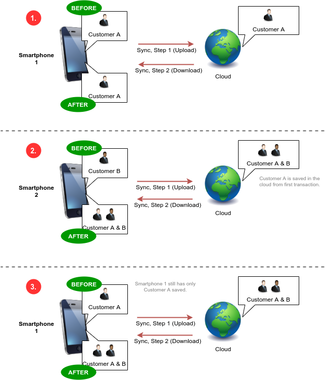

# General
This document describes the JSON-REST-API used by the Customer Database App to communicate with the server. By implementing this protocol, you can write your own server application for example if you want to use other DBMS that officially supported. The app can communicate with your own server by providing a custom server URL in the settings.

# Schematic


# JSON-RPC
A valid JSON-RPC request is sent via HTTP with the HTTP header `Content-Type: application/json` and looks like the following example.  
```
{
	"version": "2.0",
	"method": "customers.read",
	"params": {
		...................
	},
	"id": 1
}
```

# Methods
## `customers.read` - get customers from server
### Parameters
- `diff_since` (optional) - only return records changed since this date
- `username` - username for authentication
- `password` - password for authentication
- `playstore_token` (optional) - Google Play Store token for server-side subscription payment check (not of interest for self-hosted servers)
- `appstore_token` (optional) - Apple App Store token for server-side subscription payment check (not of interest for self-hosted servers)
### Example
```
{
	"jsonrpc": "2.0",
	"id": 1,
	"method": "customerdb.read",
	"params": {
		"diff_since": "2022-11-01 20:48:00",
		"username": "test@example.com",
		"password": "12345678"
	}
}
```
```
{
	"jsonrpc": "2.0",
	"id": 1,
	"result": {
		"customers": [
			{
				"id": 2020022621095229,
				"title": "Mr.",
				"first_name": "Hans",
				"last_name": "Wurst",
				"phone_home": "123456",
				"phone_mobile": "098765",
				"phone_work": "123456",
				"email": "test@example.com",
				"street": "1234 Main St.",
				"zipcode": "97000",
				"city": "Anytown",
				"country": "Or.",
				"birthday": "2020-02-28 00:00:00",
				"customer_group": "MyGroup",
				"newsletter": 0,
				"notes": "Your text here!",
				"image": null,
				"consent": null,
				"files": null,
				"custom_fields": "MyField=MyValue&",
				"last_modified": "2020-02-29 15:58:18",
				"removed": 0
			},
			.......................
		],
		"vouchers": [],
		"calendars": [],
		"appointments": []
	}
}
```

## `customers.put` - update/create customers on server
### Parameters
- `username` - username for authentication
- `password` - password for authentication
- `playstore_token` (optional) - see above
- `appstore_token` (optional) - see above
- `customers` - array of customer objects to upload/update on the server
  - attributes: `id` Bigint, `title` String, `first_name` String, `last_name` String, `phone_home` String, `phone_mobile` String, `phone_work` String, `email` String, `street` String, `zipcode` String, `city` String, `country` String, `birthday` Date String (optional), `customer_group` String, `newsletter` Int, `notes` String, `image` Base64 Encoded Image String (optional), `consent` Base64 Encoded Image String (optional) (deprecated), `custom_fields` String (details see below), `files` String (optional), `last_modified` Date String, `removed` Int
- `vouchers` - array of voucher objects to upload/update on the server
  - attributes: `id` Bigint, `original_value` String, `current_value` String, `voucher_no` String, `from_customer` String (deprecated), `from_customer_id` Bigint (optional), `for_customer` String (deprecated), `for_customer_id` Bigint (optional), `issued` Date String, `valid_until` Date String, `redeemed` Date String, `notes` String, `last_modified` Date String, `removed` Int
- `calendars` - array of calendar objects to upload/update on the server
  - attributes: `id` Bigint, `title` String, `color` String, `notes` String, `last_modified` Date String, `removed` Int
- `appointments` - array of appointment objects to upload/update on the server
  - attributes: `id` Bigint, `calendar_id` Bigint, `title` String, `notes` String, `time_start` Date String, `time_end` Date String, `fullday` Int, `customer` String (deprecated), `customer_id` Bigint (optional), `location` String, `last_modified` Date String, `removed` Int

**!! A record is only updated if `last_modified` in the request is later than `last_modified` of the record on the server !!**

### Example
```
{
	"jsonrpc": "2.0",
	"id": 1,
	"method": "customerdb.put",
	"params": {
		"username": "test@example.com",
		"password": "12345678",
		"customers": [
			{
				"id": 2020022621095229,
				"title": "Mr.",
				"first_name": "Hans",
				"last_name": "Wurst",
				"phone_home": "123456",
				"phone_mobile": "098765",
				"phone_work": "123456",
				"email": "test@example.com",
				"street": "1234 Main St.",
				"zipcode": "97000",
				"city": "Anytown",
				"country": "Or.",
				"birthday": "2020-02-28 00:00:00",
				"customer_group": "MyGroup",
				"newsletter": 0,
				"notes": "Your text here!",
				"image": null,
				"consent": null,
				"files": null,
				"custom_fields": "MyField=MyValue&",
				"last_modified": "2020-02-29 15:58:18",
				"removed": 0
			},
			...................
		],
		"vouchers": [],
		"calendars": [],
		"appointments": []
	}
}
```
```
{
	"jsonrpc": "2.0",
	"id": 1,
	"result": true
}
```

# Data Format
- Date String: `2020-01-01 18:00:00`
- Dates `issued`, `valid_until`, `redeemed`, `last_modified` should be in UTC so that there are no conflicts with clients in different time zones (the client application should display the time according to the current time zone)
- Customer Custom Fields: key-value pairs, URL encoded, separated with `&`, e.g. `Eye%20Color=green&Another%20Key=Another%20Value`
- Files: JSON array with base64 encoded file content, e.g. `[{"name":"testfile.pdf", "content":"<BASE64>"}, .......]`
- Color: HTML hex notation (e.g. `#ffffff`)
